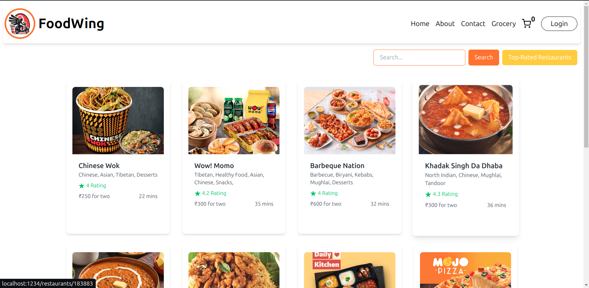
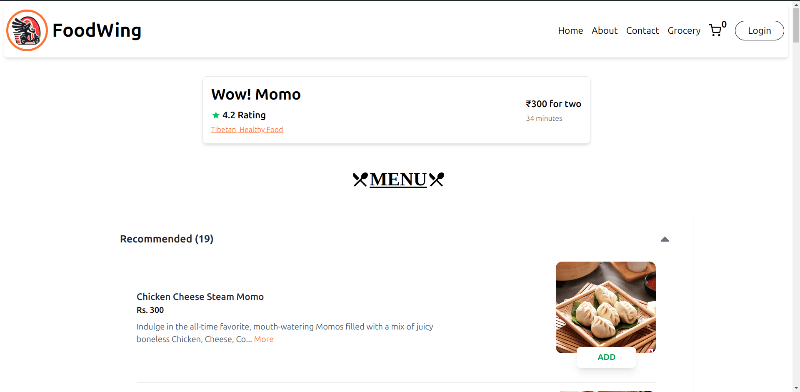
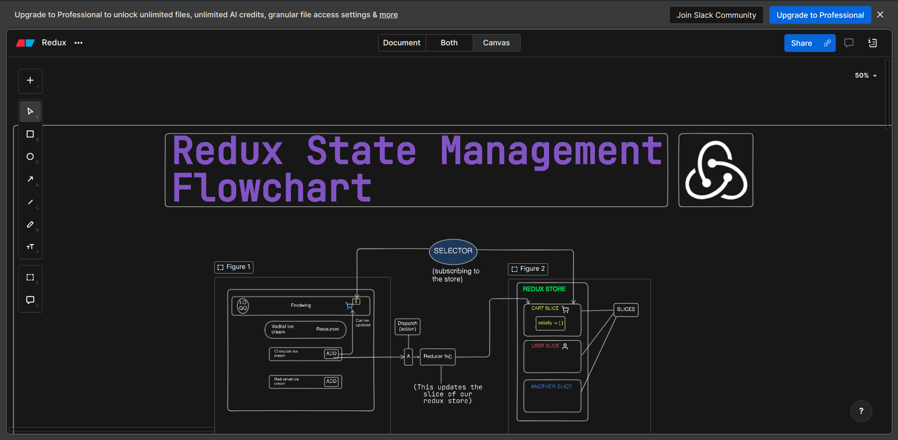

# FoodWing

A web application utilizing the Swiggy API to explore and Add to cart feature using Redux for state managment.





## Introduction

FoodWing is a web application that leverages the Swiggy API to provide users with a seamless way to explore and cart feature from various local restaurants. The application is designed to offer an intuitive user experience, allowing users to browse menus, view restaurant details, and view cart easily.

## Demo

Check out the live demo: [FoodWing](https://food-wing.vercel.app/)


## Features

- Browse restaurants and their menus
- View detailed information about restaurants
- Add items to the cart
- Responsive design for mobile and desktop users


## Redux Flowchart [Cart System] 
Check out the flowchart here :[Eraser.io](https://app.eraser.io/workspace/NYZl7TAmzosvPYIlh1Ou)



I have also created this flowchart to better explain how our Cart management system works in Redux


## Installation

To run this project locally, follow these steps:

1. **Clone the repository:**
    ```sh
    git clone https://github.com/anuj846k/FoodWing.git
    cd FoodWing
    ```

2. **Install dependencies:**
    ```sh
    npm install
    ```

3. **Create a `.env` file:**
   Add your Swiggy API key and any other necessary environment variables:
    ```
    REACT_APP_SWIGGY_API_KEY=your_api_key
    ```

4. **Run the application:**
    ```sh
    npm start
    ```

## Usage

Once the application is running, you can:

1. **Browse Restaurants:**
   - The homepage lists all available restaurants.
2. **View Restaurant Details:**
   - Click on a restaurant to view its menu and details.
3. **Add Food to Cart:**
   - Add items to your cart and proceed to checkout.

## Configuration

Ensure you have the following configurations in your `.env` file:

REACT_APP_SWIGGY_API_KEY=your_api_key


## Contributing

If you would like to contribute to this project, please feel free to submit a pull request or open an issue.


